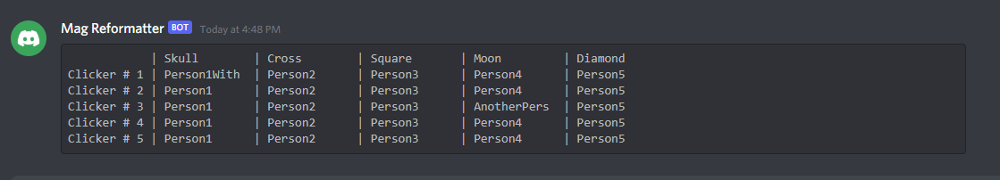

# Mag Reformatter

### (Or how to make a pretty table in Discord)

## Basic Usage

Once installed in Discord, invoke the bot with the following command: `!magformat`

Clicker groups are columnar and are numbered automatically as the table is being constructed.

### Sample Input:

    !magformat --no-delete
    Skull, Cross, Square, Moon, Diamond
    Person1WithAReallyLongName,Person2,Person3,Person4,Person5
    Person1,Person2,Person3,Person4,Person5
    Person1,Person2,Person3,AnotherPersonWithALongName,Person5
    Person1,Person2,Person3,Person4,Person5
    Person1,Person2,Person3,Person4,Person5

### Sample output:

## Detailed Explanation:

`!magformat --no-delete`

Invocation of the command is done through `!magformat` with an optional flag `--no-delete`. If this optional flag is set, the message invoking the bot will *not* be deleted, otherwise it is deleted by default.

`Skull, Cross, Square, Moon, Diamond`

The first line indicates the headers of the table to be created. In future versions, this may be formatted differently.

`
Person1WithAReallyLongName,Person2,Person3,Person4,Person5
Person1,Person2,Person3,Person4,Person5
...
`

The subsequent lines detail the Clicker order in comma-separated manner. Whitespace is stripped so the following two lines produce the same output:

`Person1WithAReallyLongName,Person2,Person3,Person4,Person5`
`      Person1WithAReallyLongName, Person2, Person3, Person4      , Person5`

**Bugs, issues, criticisms, or suggestions for improvement or other Discord bots are appreciated!**